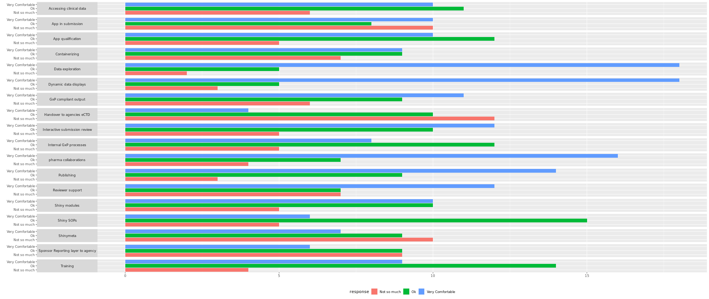

Shiny has always been a big part of RinPharma. Joe Cheng did a Keynote in 2018 (https://rinpharma.com/publication/rinpharma_33/), helped create Shinymeta in 2019, we held the popular "Unleash Shiny" in 2020 that sold out in hours and we held multiple workshops & talks on Shiny in 2021!

In 2020 we announced our future efforts around Shiny at the RStudio conference:

https://www.youtube.com/watch?v=3sU_ehLtQWM

We are now So excited to announce the launch of the "Shiny for Submissions" Task Force here in 2022! We are planning to have a monthly meeting (last thur) and quarterly workshops for the public. The workshop and learnings will be featured for the public on learn.rinpharma.com.

#### Meeting notes

Jan 27th 2022

_**Notes**_

For our first meeting, we reviewed the Current State of Shiny for submissions as detailed here:

[Current State](https://docs.google.com/document/d/1Koi0K_2P5Y827eAc2HzhYGWTE4Ws60t2iTFwVxUBkWU/edit?usp=sharing)

WE then discssed as a group, the areas of focus as highlighted below:

The top 2 areas being data exploration and dynamic data displays.

We then discussed these items in detail as outlined in the meeting mins here:

[Minutes](https://docs.google.com/document/d/17hInpK3B9dckXvf9wCNANl31chBmZ_TGwDOlkuzHfTE/edit?usp=sharing)

Our next meeting is Thur 24th of Feb 22.

